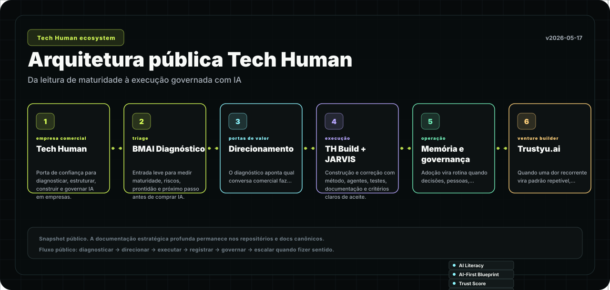

# TECH HUMAN

Technology with human purpose.

We build digital products, data platforms and AI solutions that help companies grow with clarity,
efficiency and real impact.

<p align="center">
  
</p>

This public map is a simple snapshot of how Tech Human connects diagnosis, governance, execution,
operating memory and ecosystem ventures. Strategic playbooks and internal decision rules remain
private by design.

## What We Build

| Area | Focus |
|---|---|
| Business + AI maturity | Diagnostic journeys that help companies understand readiness, risk and next steps before investing in AI. |
| Digital products | Practical web products and workflows built around real business operations. |
| Data and automation | Connected systems, operating dashboards and automation with governance. |
| AI adoption | Policies, literacy, use cases, ROI discipline and responsible implementation. |

## Public Experiences

- [techhuman.digital](https://techhuman.digital) - BMAI, our public AI maturity diagnostic.
- [techhuman.com.br](https://www.techhuman.com.br) - institutional website.
- [LinkedIn](https://www.linkedin.com/company/techhumanbr/) - company updates.

## How We Work

We believe AI only creates value when it is connected to business context, data quality, governance,
people and execution. Our work starts with clarity, then moves into practical implementation.

```text
diagnose -> prioritize -> govern -> build -> measure -> evolve
```

Some repositories in this organization are private because they contain product strategy,
implementation details or client-sensitive work.

---

Contact: [contato@techhuman.com.br](mailto:contato@techhuman.com.br)
