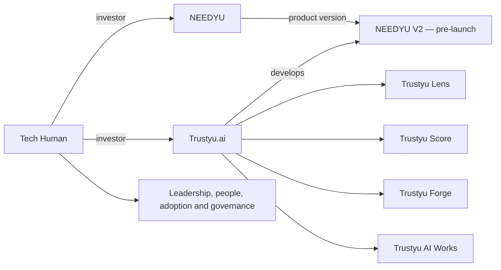

# TECH HUMAN

Technology with human purpose.

Tech Human is an investor in Trustyu.ai and needyu.ai. We help companies connect business,
human leadership, AI adoption, people and organizational governance. Each company has its own brand and commercial entry.

Trustyu.ai is a B2B accelerator of AI Native solutions, working through co-building and direct
engagements. NEEDYU V2 is developed through Trustyu and remains in pre-launch, helping people
remember, decide, act and resolve. Investment does not state ownership percentages or control.


```mermaid
flowchart LR
  TH[Tech Human] -->|investor| T[Trustyu.ai]
  TH -->|investor| N[NEEDYU]
  N -->|product version| NV2[NEEDYU V2 — pre-launch]
  T -->|develops| NV2
  T --> L[Trustyu Lens]
  T --> S[Trustyu Score]
  T --> F[Trustyu Forge]
  T --> W[Trustyu AI Works]
  TH --> O[Leadership, people, adoption and governance]
```

NEEDYU V2 remains in pre-launch. The SVG retained in this repository is a historical snapshot;
the map and institutional roles above are current as of October 2026.

This public map shows institutional roles, solution capabilities and NEEDYU V2's pre-launch status.
Strategic playbooks and internal decision rules remain
private by design.

## What We Do

| Area | Focus |
|---|---|
| Business + AI maturity | Diagnostic journeys that help companies understand readiness, risk and next steps before investing in AI. |
| Leadership and delivery | CTO/CPO leadership, specialist people and TH Build, with clear responsibility and acceptance criteria. |
| Solution collaboration | Trustyu leads AI Native solution creation and modernization; Tech Human supports leadership, adoption and governance according to scope. |
| AI adoption | Policies, literacy, use cases, ROI discipline and responsible implementation. |

## Companies and Products

- [Trustyu.ai](https://www.trustyu.ai/) — B2B solution accelerator; Trustyu Lens evaluates the problem, Score assesses systems, Forge provides the engineering harness, and AI Works is the development and modernization platform. Each product has its own readiness gates.
- [NEEDYU](https://needyu.ai/) — independent product invested in by Tech Human; V2 developed through Trustyu, in pre-launch.
- BMAI assesses organizational maturity. Trustyu Score assesses a concrete system, including legacy and AI-built software; their scores are separate.

## Public Experiences

- [techhuman.digital](https://techhuman.digital) - BMAI, our public AI maturity diagnostic.
- [techhuman.com.br](https://www.techhuman.com.br) - institutional website.
- [LinkedIn](https://www.linkedin.com/company/techhumanbr/) - company updates.

## How We Work

We believe AI only creates value when it is connected to business context, data quality, governance,
people and execution. Our work starts with clarity, then moves into practical implementation.

```text
diagnose -> prioritize -> govern -> build -> measure -> evolve
```

Some repositories in this organization are private because they contain product strategy,
implementation details or client-sensitive work.

---

Contact: [contato@techhuman.com.br](mailto:contato@techhuman.com.br)
